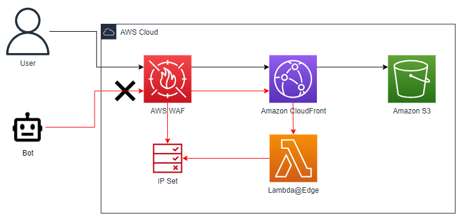

# aws-edge-honeypot-poc
PoC of a security mechanism using AWS Lambda@Edge, AWS WAF, and honeypot links to identify and block malicious web traffic. 

# Strategy
A honeypot is a security mechanism that uses a decoy (i.e., the "honeypot") to detect, deflect, or study attempts at unauthorized use of information systems. In web applications, a honeypot can take the form of seemingly ordinary links or pages that are invisible to regular users but are discoverable by web scrapers and bots.

In this PoC, we use a custom behavior from CloudFront to call a Lambda@Edge function to update a WAF IP Set (From a Web ACL used by the CloudFront distribution) with the IP that requested the honeypot path. By monitoring the honeypot path, we can identify and block IP addresses interacting with them, assuming that legitimate users would never find or interact with these paths.

# Infrastructure
The infrastructure for this project is defined in Terraform. It includes:

- An S3 bucket to host your content
- A CloudFront distribution to serve your content
- A Lambda@Edge function that is triggered on viewer requests to a specific path (honeypot) on the CloudFront distribution
- An AWS WAF IP Set, which the Lambda function uses to block IP addresses
- A Web ACL that uses the IP Set to block requests from the blocked IP addresses

| ℹ️ Information                           | 
|------------------------------------------|
| Due to restrictions on Lambda@Edge functions, environment variables are not allowed. Therefore, the Lambda function must have the IP Set ID hardcoded into its code.         |

<p align="center">
  
</p>

# Setup 

- **Apply the Terraform configuration:** Run ```terraform apply``` to create the S3 bucket, CloudFront distribution, Lambda function, and WAF resources. This also outputs the IP Set ID.

- **Update the Lambda function code:** Check the output to find the IP Set ID. Replace the placeholder in the Lambda function code (waf_lambda_function.py) with this IP Set ID.

- **Apply the Terraform configuration again:** Run ```terraform apply``` again to publish the updated Lambda function code and create a new version of the function.
